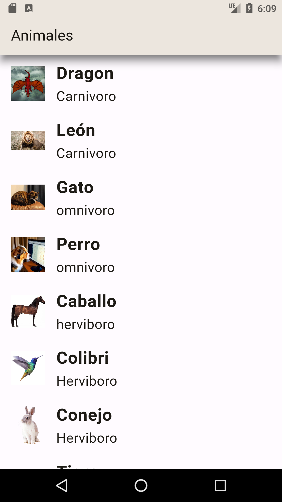
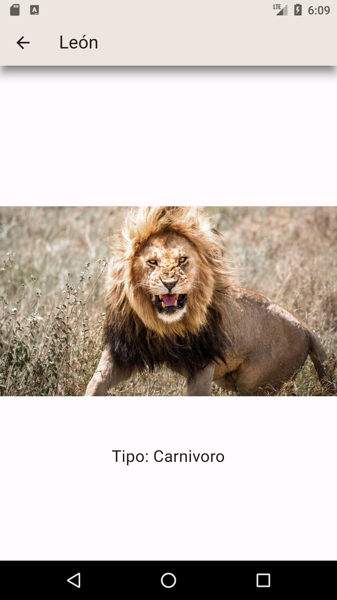
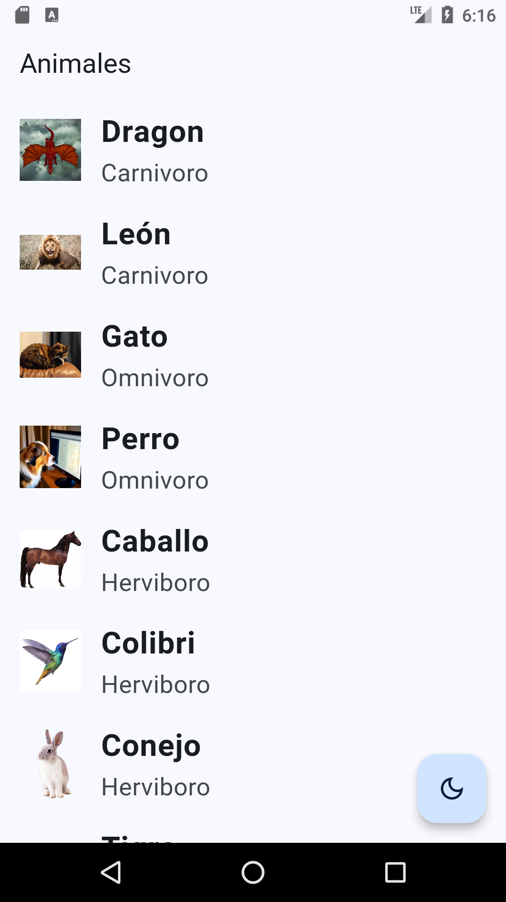
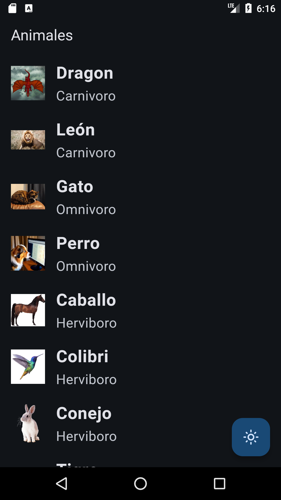

# 🐲🐯 listmaster Animals or Criatures 🐶🐱

In this project, I had worked with *ListView* to create the items list of Animals or criatures.

    

I created an object called Animal with their attributes which are name, specie and type, then that were assigned for each new Animal that I was creating. 

On the other hand, when we have select an item of the list (**onTap**) with *GestureDetector* and *Navigator* widgets, we are going to other route that shows our animal selected.

    

This route was created with a class FichAnimal which make a new screen with only two items the image and a text like description of their animal type. 

## 🌞 Adaptive theme 🌚

I used the plugin [adaptive_theme](https://pub.dev/packages/adaptive_theme "Doc about plugin") to change the application theme with a FloatingActionButton. 

    
    

